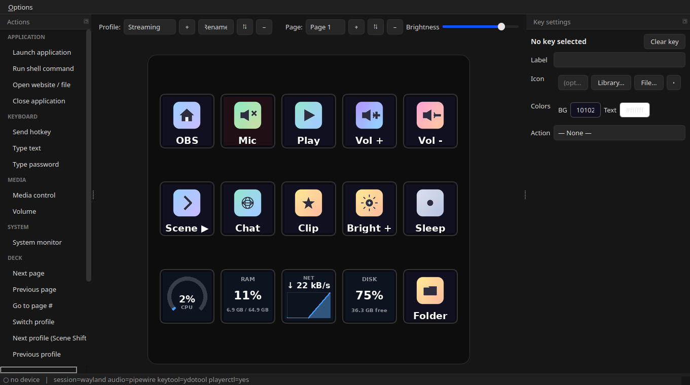
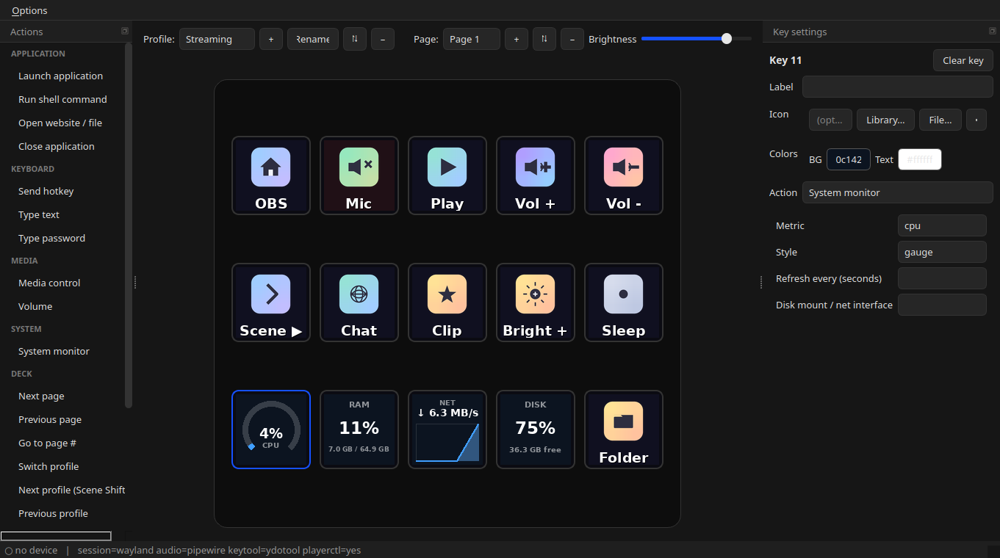

# Fifine Control Deck — Linux
https://fifinemicrophone.com/pages/download-fifine-d6-software

A native Linux control application for the **fifine Control Deck** (a Mirabox /
Hotspot "Stream Dock" style macro keypad with per-key LCDs, USB id
`3142:0060` "HOTSPOTEKUSB"). It is a from-scratch reimplementation of the
Windows software's core: it draws icons/labels on the keys, reacts to key
presses, and runs actions (launch apps, hotkeys, media/volume, scripts…),
with profiles, multiple pages, a configuration GUI, and a system tray.

> The Windows app is a closed-source Qt5 + Chromium (CEF) bundle. This project
> reuses only the vendor's **MIT-licensed** `StreamDock` device backend (the
> `libtransport.so` USB layer) and builds an original Python/PyQt6 app on top.

## Links

- **Website:** <https://zoutmax.github.io/FifineControlDeck/>
- **Launchpad PPA** (apt) — **recommended, drives the deck fully:**
  `sudo add-apt-repository ppa:zoutmax/fifine && sudo apt install fifine-control-deck`
  (<https://launchpad.net/~zoutmax/+archive/ubuntu/fifine>)
- **Direct download** (`.deb`, amd64/arm64):
  <https://github.com/ZoutMax/FifineControlDeck/releases/latest>
- **Source (GitHub):** <https://github.com/ZoutMax/FifineControlDeck>
  ([Releases](https://github.com/ZoutMax/FifineControlDeck/releases) ·
  [Issues](https://github.com/ZoutMax/FifineControlDeck/issues))
- **Launchpad project:** <https://launchpad.net/fifine-control-deck>
  ([code mirror](https://code.launchpad.net/~zoutmax/fifine-control-deck/+git/fifine-control-deck-linux))

Available for **amd64** and **arm64** via the PPA and `.deb`.

> **Store availability:** Snap and Flathub submissions are on hold. The deck is
> driven over `/dev/hidraw` with a vendor HID protocol, which strict snap
> confinement cannot grant and which sits awkwardly with Flatpak sandboxing, and
> both stores reasonably want more development history from a young project.
> Both will be revisited once the project has a longer track record. The PPA and
> `.deb` are fully supported and are the recommended way to install.

## Status: Alpha

The core is feature-complete and hardened, and every release is exercised on
real hardware before it ships (see [`tools/e2e_live.py`](tools/e2e_live.py) —
end-to-end journeys against an actual deck, run manually as a release gate, on
top of the automated suite). It is still early software. Realistic
expectations:

- ✅ **Verified on hardware:** Stream Dock **293V3 family** (`3142:0060`, 15 keys) —
  images, key input, brightness, folders, multi-actions, press-and-hold,
  monitor keys, hotplug.
- ⚠️ **Other Stream Dock models** are in the device table but **untested** here —
  key count / image size / mapping may need tuning in `DEVICE_PROFILE`.
- ⚠️ **Knob/dial** support is implemented but **unverified** (no knob hardware).
- ⚠️ Limited field testing across distros/desktops. Feedback and device reports
  (via GitHub issues) are very welcome.

## Screenshots





## Features

- Live per-key icons + text labels, colour backgrounds, custom images, and
  **animated GIF keys**.
- **Drag-and-drop Actions catalog** — drag an action from the sidebar onto a
  key (auto-assigns a matching icon + label).
- Actions (modeled on the original): launch app, run shell command, open
  URL/file, close application, send hotkey, type text, type password, media
  control, volume up/down/mute, brightness, sleep screen, page next/prev/goto,
  switch profile, next/previous profile (Scene Shift), and multi-step actions.
  Key actions run on a worker thread, so a slow/delayed macro never blocks the
  keypad. Every key can also carry a **hold action** — a second action that
  fires after long-pressing the key (~0.5 s).
- **System-monitor keys** — a key can show live **CPU, RAM, VRAM, GPU load,
  GPU/CPU temperatures, network or disk-space** readouts (like the official
  app's widgets) — or a **clock** (12h/24h, optional seconds and date) — as a
  big number, a gauge (a network key falls
  back to the number face), or a scrolling graph, with a configurable refresh
  interval. Keys showing the same metric share one sample stream. Temperature
  keys pick the CPU package sensor by default; the target field selects any
  other `psutil` sensor as `chip` or `chip:label` (e.g. `nvme:Composite`).
  VRAM and GPU load are best-effort per GPU vendor (NVIDIA via NVML — needs
  `python3-pynvml`; AMD via sysfs; Intel iGPUs share system RAM so there is
  nothing to show).
- **Knob/dial support** (press / rotate-left / rotate-right) on devices that
  have dials.
- **Composable by design** — the *Run shell command* action turns any script
  into a key. Community recipes live in [`contrib/`](contrib/), including
  [offline voice dictation on a key](contrib/dictation/) (press, speak in
  English or French, press — your words type themselves).
- Multiple **profiles**, each with multiple **pages**, plus **folders** —
  drop an *Open folder* action on a key, double-click it in the editor to go
  in (a **Back** key returns); folders can nest and have their own pages.
- Three-pane configuration GUI (actions catalog · live device grid · key
  settings) with a dark theme matching the original; optional system tray.
- Optional headless daemon mode + systemd user service for autostart.
- Hotplug aware (unplug/replug re-applies the current page).

## Requirements

Already present on most desktops / this machine:

- Python 3.10+
- **PyQt6**, **Pillow** and **psutil** (system packages: `python3-pyqt6`,
  `python3-pil`, `python3-psutil`)

Optional, for specific actions (install what you use):

| Action            | Needs                                            |
|-------------------|--------------------------------------------------|
| Volume            | PipeWire (`wpctl`) or PulseAudio (`pactl`)       |
| Media play/pause  | `playerctl`                                      |
| Hotkey / type text| `ydotool` (Wayland) or `xdotool` (X11) / `wtype` |
| Open URL/file     | `xdg-open` (`xdg-utils`)                         |
| NVIDIA VRAM key   | `python3-pynvml` (AMD needs nothing — sysfs)     |

The status bar shows what was detected on your session.

> **ydotool note (Wayland):** hotkey / type-text actions use `ydotool`, which
> needs its background daemon. The `ydotool` package ships a user service —
> enable it once:
> ```bash
> systemctl --user enable --now ydotool
> ```
> (It talks to `/dev/uinput`, which the desktop session grants via an ACL.)
> On X11, `xdotool` works with no daemon. `playerctl` (media) and `wpctl`
> (volume) need no daemon.

## Install (.deb — recommended)

Works on any Debian-family distro (Debian, Ubuntu, Linux Mint, Pop!_OS,
elementary, Zorin, Raspberry Pi OS, …) on **amd64** or **arm64**. Download the
package for your CPU and install it — this one-liner auto-detects the arch:

```bash
ARCH=$(dpkg --print-architecture)   # amd64 or arm64
wget https://github.com/ZoutMax/FifineControlDeck/releases/latest/download/fifine-control-deck_${ARCH}.deb
sudo apt install ./fifine-control-deck_${ARCH}.deb
```

`apt install ./…deb` **installs all dependencies automatically** — PyQt6 and
Pillow, plus the optional helper tools (`playerctl`, `ydotool`, PipeWire's
`wpctl`, `xdg-utils`) that power the media/hotkey/volume actions. Or, from a
clone, just run **`./install.sh`** (auto-detects your architecture and adds you
to the `plugdev` group).

(A double-click in a graphical installer — GNOME Software, Discover, GDebi —
also resolves dependencies. Plain `sudo dpkg -i …deb` does **not**; follow it
with `sudo apt-get -f install`.)

Or grab a specific version from the
[Releases page](https://github.com/ZoutMax/FifineControlDeck/releases).

**Requirements:** Python ≥ 3.10 and PyQt6 (present on Debian 12+, Ubuntu 22.04+,
Mint 21+ and newer). The bundled USB transport library needs only glibc ≥ 2.17,
so it runs on essentially any current release.

This installs the app, a desktop launcher (**fifine Control Deck** appears in
your app menu), the icon, and the udev rule. Make sure you're in the `plugdev`
group, then unplug/replug the device once:

```bash
sudo usermod -aG plugdev "$USER"   # then log out/in if it was just added
```

To build the `.deb` yourself: `./packaging/build-deb.sh` → `dist/`.

**Snap (on hold):** the app builds as a **classic** snap that drives the deck
(the strict snap can't — it has no route to `/dev/hidraw`). Packaging lives in
`snap/`; see [`docs/SNAP.md`](docs/SNAP.md). Classic confinement needs Canonical
approval, which is on hold until the project has more history, so nothing is
currently published to the store. On first run, if the deck
isn't detected the app shows an **"Enable device access"** button that installs
the required udev rule for you via a graphical password prompt and reconnects —
no terminal needed (a snap can't install a udev rule itself). Until the store
review is revisited, use the PPA / `.deb`.

**Launchpad PPA (apt):** Debian source packaging lives in `debian/` — see
[`docs/PPA.md`](docs/PPA.md) to build the source package and upload it so users
can `sudo add-apt-repository ppa:zoutmax/fifine && sudo apt install
fifine-control-deck`.

## Run from source (development)

1. **Install the udev rule** (one time, needs root) so the device is usable
   without `sudo`:

   ```bash
   sudo ./packaging/install-udev.sh
   ```

   Then **unplug and replug** the device. You must be in the `plugdev` group.

2. **Run the app:**

   ```bash
   ./run.sh
   ```

   or `python3 -m fifine_deck`. Use `--headless` for the daemon-only mode.

## Icons

The app ships a built-in icon library (`assets/icons/library/`) — pick icons in
the key editor via **Library…**, or load your own image with **File…**. Icons
are regenerated with `python3 tools/make_icons.py`.

## Autostart on login

Run the deck automatically on login — the window starts hidden, and your keys
are active immediately. Open the window any time by launching the app again
(it re-uses the running instance); close it to hide back to the background.

```bash
fifine-control-deck --enable-autostart      # or Options -> "Start on login (hidden)"
fifine-control-deck --disable-autostart     # turn it off
```

Advanced: a headless (no-GUI) systemd **user** service is also provided in
`packaging/fifine-deck.service` if you prefer running without any window.

## Configuration

Stored at `~/.config/fifine-control-deck/config.json` (saved automatically, and
kept `0600` since it can hold password actions). Built-in icons are referenced
portably as `lib:<name>`, so an exported config carries them across machines;
custom icons chosen with **File…** are referenced by absolute path. Use
**Options → Export/Import config** to back up or move your layout.

## Device profile

The device geometry (key count, pixel size, image rotation, hardware key
mapping) lives in one place: `DEVICE_PROFILE` in `fifine_deck/device.py`.
`probe_device.py` confirms the correct values against your hardware.

## Project layout

```
fifine_deck/
  backend/StreamDock/   vendored MIT device SDK (+ libtransport.so)
  device.py             FifineDeck wrapper + DEVICE_PROFILE
  model.py              config data model (profiles/pages/keys/actions)
  actions.py            action engine + Linux environment detection
  rendering.py          key-image rendering (device + GUI preview)
  controller.py         runtime: device <-> config <-> actions, hotplug
  gui/                  PyQt6 GUI (grid, editor, profiles, pages, tray)
  app.py                entry point (GUI / --headless)
probe_device.py         one-off hardware profiler
packaging/              udev rule, installer, systemd unit
```

## Licensing

The vendored `backend/StreamDock/` directory is the MIT-licensed
`MiraboxSpace/StreamDock-Device-SDK` (see `backend/StreamDock/LICENSE.vendor`).
Application code in this repo is original.
